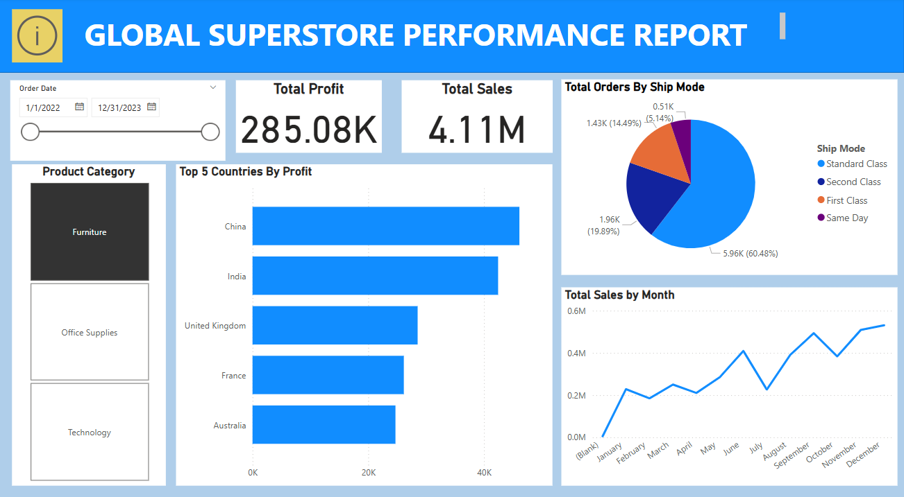

# Global Superstore Performance Report
This Power BI dashboard summarizes global retail superstore performance, showing KPIs like profit, sales, fulfillment by shipping method, seasonality, and geographic profitability. Designed for management and sales teams, it delivers real-time insights through a clean, interactive interface for informed decision-making.

**Title:** [Global Superstore Performance Report](https://github.com/Osiwi/github.io/blob/main/Global%20Superstore%20Dashboard.pbix)

**Tools & Technologies Used:**
Power BI Desktop: Core platform for building the interactive report and dashboards.
Power Query: Used to clean, transform, and prepare sales and profit data for analysis.
DAX (Data Analysis Expressions): Employed for calculated fields such as total profit, dynamic date filtering, and top N categories.
Visual Elements Used:
Cards: For KPIs like Total Profit and Total Sales.
Slicers: Interactive filtering by Order Date and Product Category.
Bar Chart: For Top 5 Countries by Profit.
Pie Chart: For Total Orders by Ship Mode.
Line Chart: For Total Sales by Month.

**Project Description Overview:**
This Power BI dashboard provides a high-level performance summary of a global retail superstore's operations. It captures key performance indicators (KPIs) such as profit, total sales, order fulfillment by shipping method, sales seasonality, and profitability by geography. Built for senior management and sales teams, the dashboard enables real-time decision-making by presenting business insights in a clean and interactive layout.

**Objective:**
To deliver a real-time, data-driven overview of global sales and profitability trends, allowing business stakeholders to monitor regional performance, optimize shipping logistics, and identify high-performing product categories and markets.

**Key Features Included in the Dashboard:**
KPI Cards showing Total Profit (285.08K) and Total Sales (4.11M).
Top 5 Countries by Profit visualized through a horizontal bar chart.
Ship Mode Analysis via a pie chart displaying order distribution (Standard, First Class, Second Class, Same Day).
Sales Trend Over Time using a line chart by month to highlight seasonality.
Interactive Filtering:
Date Slicer to filter reports dynamically from 2022–2023.
Product Category Selector for segmenting performance by Furniture, Office Supplies, or Technology.

**Key findings:**
China and India lead global profits, with China achieving the highest margin.
Standard Class shipping accounts for 60% of all orders, followed by Second and First Class.
December is the peak sales month, followed by strong performances in October and July, indicating seasonal buying behavior.
Furniture leads in profit among product categories during the selected time period.
Total profit during 2022–2023 is $285.08K, with cumulative sales exceeding $4.1M.

**Dashboard Overview:** 

